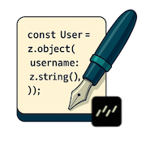

# Drizzle Zod To Code



Generate JavaScript/TypeScript code for Drizzle Zod schemas

[](https://www.npmjs.com/package/@lucaconlaq/drizzle-zod-to-code)
[](https://biomejs.dev)
[](https://vitest.dev)

---

## ✨ Why?

This library was born in response to a need discussed in [drizzle-orm issue #941](https://github.com/drizzle-team/drizzle-orm/issues/941): generating static validation schemas (i.e. Zod) from Drizzle ORM models without bundling Drizzle into the client.

- 🔄 It extracts schema logic from Drizzle models and outputs Zod code using [`zod-to-code`](https://www.github.com/lucaconlaq/zod-to-code).
- 🔐 This keeps your frontend secure by removing ORM logic from client builds.
- 🧩 Great for full-stack apps that share validation between backend and frontend.

---

⚠️ Why dynamic Zod schemas are not always ideal

When sharing validation between server and client, using dynamic (runtime) Zod schemas, generated with [drizzle-zod](https://orm.drizzle.team/docs/zod) can lead to several issues:

- 🔓 Risk of code leakage – Dynamic schemas created with createInsertSchema or similar rely on Drizzle's runtime logic. When used in frontend code, this can unintentionally bundle server-only logic into the client, potentially exposing sensitive code or internal database structures.
- 🐘 Large bundle size – Including Drizzle ORM in the client pulls in unnecessary dependencies, increasing bundle size and hurting performance.

Static schema generation avoids all of these issues.

---

## 🚀 Installation

```bash
npm i @lucaconlaq/drizzle-zod-to-code
```

---

## 📦 Usage

```bash
npx drizzle-zod-to-code generate --out ../schemas/src/
```

### Options

- `--config <path>` - Path to drizzle.config.ts (default: "drizzle.config.ts")
- `--out <path>` - Path for generated Zod schemas (default: "src/schemas")
- `--ts-config <path>` - Path to tsconfig.json (default: "tsconfig.json")
- `-h, --help` - Display help for command

### Add to package.json

You can add it to your `package.json` scripts:

```json
{
  ...
  "scripts": {
    ...
    "drizzle:generate": "drizzle-kit generate",
    "drizzle:migrate": "drizzle-kit migrate",
    "drizzle:push": "drizzle-kit push",
    "drizzle:pull": "drizzle-kit pull",
    "drizzle:studio": "drizzle-kit studio",
    "drizzle:generate:zod": "drizzle-zod-to-code generate --out ../schemas/src/"
  }
}
```

Then you can run:
```bash
npm run drizzle:generate:zod
```

---

## 🚨 Limitations

This is an initial release focused on the most common use cases. While it provides a solid foundation for generating static Zod schemas from Drizzle models, it does not cover all the use-cases that drizzle-zod support. If you find a bug, please consider contributing.

### ✅ Test Coverage

The test suite in `test/drizzle/` mirrors the test suite of `drizzle-zod`. Here's a summary of the current test coverage across different databases:

| DB         | Files                                                                 | Total Tests | Skipped |
|------------|-----------------------------------------------------------------------|-------------|---------|
| 🐬 MySQL    | `mysqlTable`, `mysqlView`, `mysqlTypes`, `mysqlSchemaValidation`     | 21          | 13      |
| 🐘 Postgres | `pgTable`, `pgView`, `pgTypes`, `pgSchemaValidation`                 | 22          | 8       |
| 🪨 SQLite   | `sqliteTable`, `sqliteView`, `sqliteTypes`, `sqliteSchemaValidation` | 18          | 13      |

